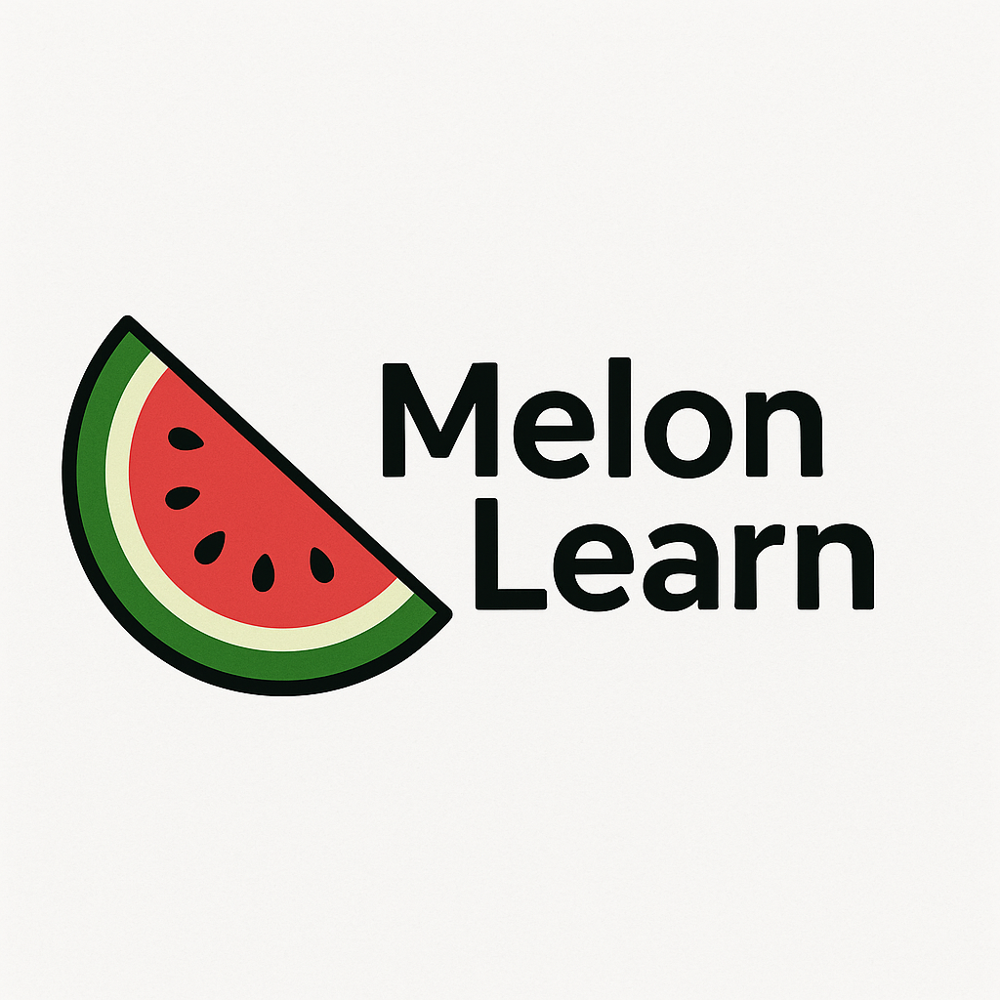

# MelonLearn
<p align="center">
  
</p>

**MelonLearn** is an educational open-source machine learning and deep learning library, meticulously implemented from scratch using Python. This library aims to provide clear, understandable, and extensible implementations of various machine learning algorithms, making it an excellent resource for learning and experimentation.


## 1. Features

### Machine Learning:
- ### Supervised:
    - #### Classification 
        - Decision Tree 

        - K-Nearest Neighbors (KNN) 

        - Linear Support Vector Machine (LinearSVM) 

        - Logistic Regression 

        - Naive Bayes 

        - Random Forest 

        - Support Vector Machine (SVM) 
    - #### Regression 
        - Lasso Regression

        - Linear Regression 

        - Random Forest Regression 

        - Regression Tree 

        - Support Vector Regression (SVR) 
- ### Unsupervised:
    - #### AnomalyDetection
        - IQR
        - Isolation Froest 
        - z-score
    - #### Clustering
        - DBscan
        - PCA
        - ICA
        - K means
    
- ### Reinforcement
    - Policy Optimization (PPO)
    - Q - Learning

###  Deep Learning:
- includes the following specific components:
    - ### Layers:

        - Conv2D (Convolutional Layer)

        - Dense (Fully Connected Layer)

        - Dropout

        - Flatten

        - Maxpool2D (Max Pooling Layer)

    - ### Loss Functions:

        - Crossentropy

        - MSE (Mean Squared Error)

    - ### Optimizers:

        - Adam

        - Momentum

        - RMSprop

        - SGD (Stochastic Gradient Descent)

Additionally, there appears to be a `Sequential` module, which likely represents a Sequential model API for stacking layers.


## 2. Philosophy

MelonLearn is designed with a focus on:

- **From-Scratch Implementation**: Algorithms are built from the ground up to provide deep understanding.  
- **Extensibility**: Modular design makes it easy to add new models or enhance existing ones.  
- **Experimentation**: Flexible framework to test algorithms and tune hyperparameters.  
- **Educational Value**: Ideal for students, researchers, and developers who want to learn the core concepts of ML and DL.


## 3. Getting Started

To clone and start using MelonLearn:

```bash
git clone https://github.com/mohamedelsayed0001/MelonLearn.git
cd MelonLearn
```
Usage example 
```python 
import melonlearn

# Load a dataset
 X, y = ...

# Initialize and train a model
 model = melonlearn. ... ()

# model.train(X, y)
 model.train(X, y)

# Make predictions
 predictions = model.predict(X_new)

```
## 4.  License
 
This project is licensed under the MIT License – see the LICENSE file for details.


